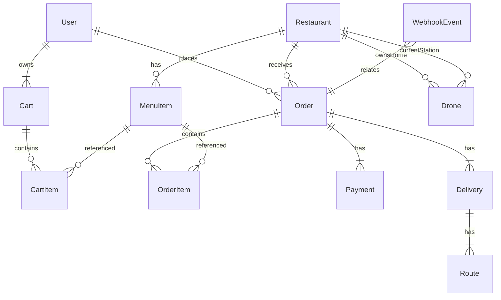

# ERD (Đơn giản)

## Ghi chú
- `workRestaurantId` trên User (role RESTAURANT) liên kết tới Restaurant (nhân viên nhà hàng).
- Drone có `homeStationId` (trạm sở hữu) và `currentStationId` (trạm đang đậu).
- WebhookEvent đảm bảo idempotency cho Payment webhook.

## Indexes quan trọng
- User: (role, workRestaurantId)
- Drone: (status, priority)
- Order: (userId, createdAt), (restaurantId, createdAt)
- Delivery: (status)
- MenuItem: (restaurantId, isAvailable)

## Luồng chính
1. User tạo Order (CREATED) + Payment (PENDING).
2. Webhook xác nhận -> Order CONFIRMED.
3. Kitchen PREPARING -> DISPATCHED (create Delivery QUEUED).
4. Drone ASSIGNED -> EN_ROUTE -> COMPLETED (Order DELIVERED).
5. Tồn kho MenuItem giảm tại COMPLETED.
