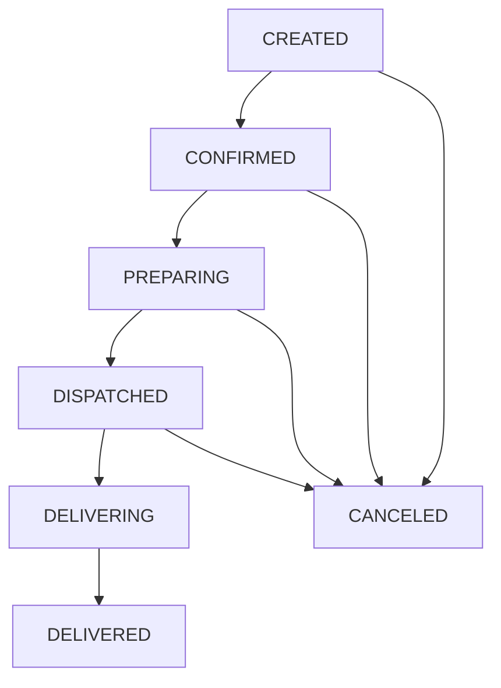
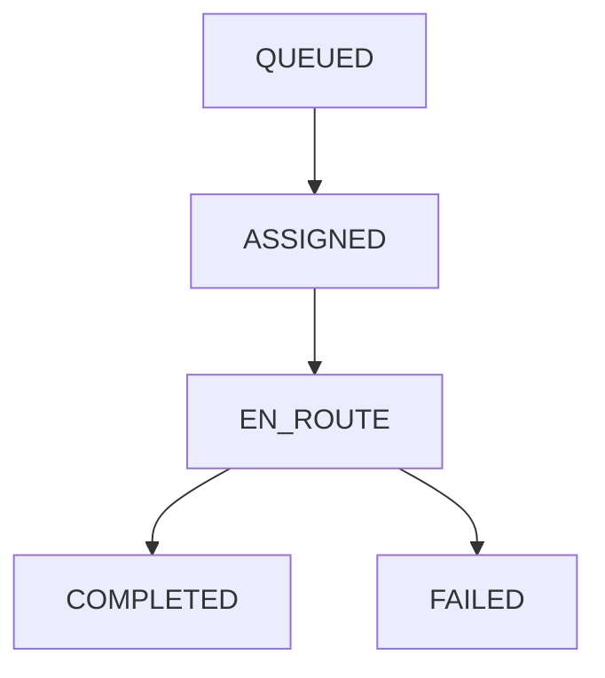

# STATE_MACHINE

Mô tả trạng thái và chuyển đổi chính của Order & Delivery.

## Order Status Flow

- CREATED: đơn mới sau checkout.
- CONFIRMED: sau khi thanh toán (Payment PAID, hoặc xác nhận thủ công).
- PREPARING: bếp/kitchen bắt đầu chế biến.
- DISPATCHED: đã chọn drone & tạo Delivery (Delivery QUEUED/ASSIGNED).
- DELIVERING: hàng đang trên đường (Delivery EN_ROUTE).
- DELIVERED: thành công (Delivery COMPLETED).
- CANCELED: huỷ bất kỳ trước khi giao thành công.

## Payment Status
- PENDING -> PAID | FAILED | REFUNDED

## Delivery Status Flow

Chi tiết phases nội bộ (JSON `route.path.phases`):
- TO_HOME_FOR_DISPATCH -> CHARGING_FOR_DISPATCH -> TO_CUSTOMER.

## Ràng buộc & Idempotency
- Payment webhook chỉ nâng Order từ CREATED -> CONFIRMED nếu chưa CONFIRMED.
- COMPLETE Delivery giảm tồn kho items đúng 1 lần (transaction + status check).

## Sự kiện WebSocket
- `order-update`: phát khi Order/Delivery thay đổi (đến room `order:<orderId>`).
- `delivery-update`: phát tới `admin:drones`.
- `dashboard-update`: thống kê KPI cho admin.

## Lỗi & Phục hồi
- Nếu drone FAIL (FAILED), có thể tái tạo Delivery mới (QUEUED) và gán drone khác.
